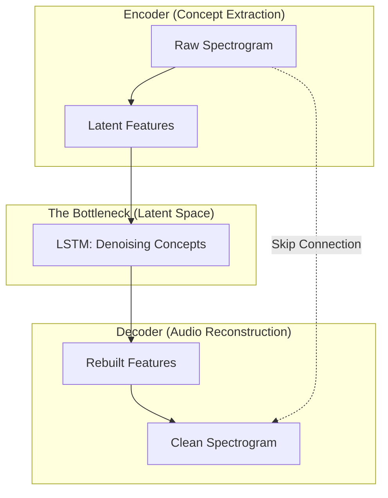

## 1. The Architecture: The "Hourglass" Shape

DCCRN uses a **U-Net** structure. It compresses the signal into a **Latent Space** to find the core "meaning" of the sound, and then reconstructs it.

### The "Bottleneck" (Latent Space)
At the very bottom of the "U" is the **Latent Space**. This is where the LSTM resides.
*   **Encoder**: Compresses 257 frequency bins into a small **Latent Vector** (e.g., just 5 high-level features).
*   **LSTM**: Processes these "conceptual" vectors across time. It doesn't look at raw waves; it looks at the **logic of the sound** (e.g., *"Is this speech pattern continuing?"*).
*   **Decoder**: Rebuilds the audio from the "cleaned" latent concepts.

### Why the "U" Shape?
*   **Encoder**: "Squints" at the noise to extract the most important features.
*   **Bottleneck (LSTM)**: Remembers the history of the sound (e.g., *"the fan hum has been constant for 10 seconds"*).
*   **Decoder**: Uses the **Skip Connections** (dotted lines) to retrieve high-resolution details that were lost during compression.

---

## 2. The "Complex" Secret

Standard AI models are "Real-Valued." DCCRN is **Complex-Valued**.

> [!IMPORTANT]
> Audio isn't just a list of numbers; it's a **Wave**. 
> Waves have **Magnitude** (Loudness) and **Phase** (Timing).

| Feature | Real-Valued AI | Complex-Valued (DCCRN) |
| :--- | :--- | :--- |
| **Magnitude** | Processed | Processed |
| **Phase** | Ignored (Muffled sound) | **Preserved (Natural sound)** |
| **Analogy** | A blurry black-and-white photo. | A sharp, high-definition color video. |

By using complex numbers ($a + bi$), the model knows exactly where a wave is in its cycle, allowing it to perform **Phase-Aware** enhancement.

---

## 3. How the "Denoising" Actually Happens

DCCRN doesn't just "guess" what a clean voice sounds like. It creates a **Mask**.

1.  **Input**: Dirty Audio (Voice + Traffic + Laptop Fan).
2.  **Estimation**: The model predicts a **Complex Ratio Mask (CRM)**.
3.  **Application**: Imagine the Mask is like a pair of "Smart Sunglasses." It blocks out the "light" (frequencies) coming from the noise and only lets the "light" from the voice pass through.
4.  **Result**: The dirt is subtracted, and the voice remains untouched.

---

## 4. DCCRN vs. Traditional Filters (FxLMS)

| Feature | Traditional (FxLMS) | DCCRN (AI) |
| :--- | :--- | :--- |
| **Learning** | Math-based adjustments. | Pattern-based prediction. |
| **Speed** | Instant. | High (but needs a GPU/CPU boost). |
| **Steady Noise** | Excellent. | Excellent. |
| **Sudden Noise** | Fails (too slow to adapt). | Handles (knows a 'bark' isn't a 'voice'). |
| **Intelligence** | Reactive. | Proactive. |

---

## Conclusion

---

## 5. The Big Shift: No "Anti-Noise"?

If you are coming from the **FxLMS** project, you might be looking for the "Anti-noise" signal. Here is the secret: **DCCRN doesn't use anti-noise.**

| Concept | ANC (FxLMS) | Denoising (DCCRN) |
| :--- | :--- | :--- |
| **Mechanism** | **Physical Cancellation**: Play a "negative" sound through a speaker to destroy noise in the air. | **Digital Erasing**: Modify the 0s and 1s of the audio data in memory to remove noise. |
| **Goal** | Silence in a physical room. | High-quality audio for a recording or a Zoom call. |
| **Sudden Noise** | Fails. The math can't "anticipate" a sudden dog bark. | Succeeds. The AI "recognizes" the shape of a bark and mutes it instantly. |

### How it "sees" a bark:
DCCRN handles sudden noise (like a dog barking or a glass breaking) because it has seen it before during training. 
1.  **Recognition**: It sees a vertical "spike" in the frequency spectrum that doesn't match the horizontal "harmonic" patterns of speech.
2.  **Instant Muting**: Because it's an AI model, it doesn't need to "adapt" slowly like a mathematical filter. It just mutess those specific pixels in the spectrogram for that specific millisecond.

> [!TIP]
> **DCCRN is a Digital Eraser.** It transforms the "Dirty" data into "Clean" data, whereas FxLMS is a **Wave Fighter** that tries to tackle sound in the physical world.
