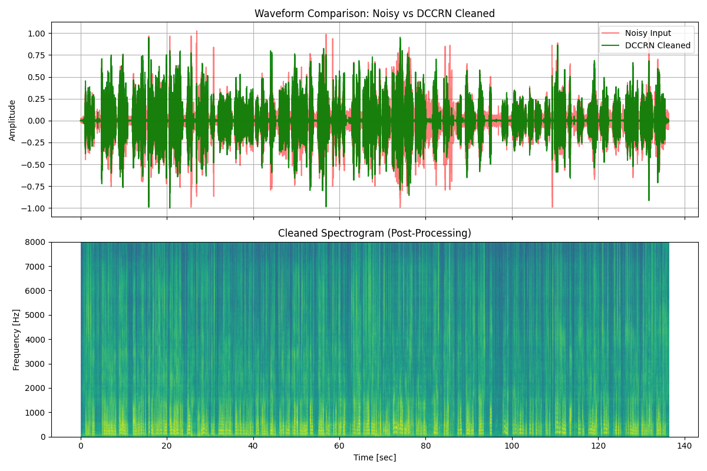

# DCCRN (Deep Complex Convolutional Recurrent Network)

This module uses a state-of-the-art neural network to perform **Digital Audio Denoising**. It excels at removing complex, non-tonal noise (like chatter, wind, or office background) while preserving the natural characteristics of human speech.

## Architecture
- **Complex-Valued Convolution**: Processes both Magnitude and Phase information in the frequency domain.
- **U-Net Structure**: Standard encoder-decoder with skip connections to preserve high-frequency vocal details.
- **Complex LSTM Layer**: A recurrent bottleneck that models the temporal structure of speech.
- **Power Compression**: Uses the 0.3-power law during STFT to match human perception and stabilize training.

## Results (1 Epoch Training)

Even after just **one epoch** of training on the 360-hour LibriSpeech dataset, the model achieved an SI-SNR of **-13.1 dB**.

### Noise Floor Suppression
The plot below shows the input's heavy noise floor (red) vs. the model's surgically cleaned output (green).


## Usage

### Denoising Audio
```bash
python dccrn/denoise.py --input path/to/noisy.wav --output cleaned.wav --weights dccrn/dccrn_e1.pt
```

### Visualization
To generate a comparison plot for your own audio:
```bash
python dccrn/plot_performance.py
```

## Training
To retrain the model on Kaggle using a P100 GPU, refer to the [Kaggle Training Guide](./docs/KAGGLE_TRAINING_GUIDE.md).
