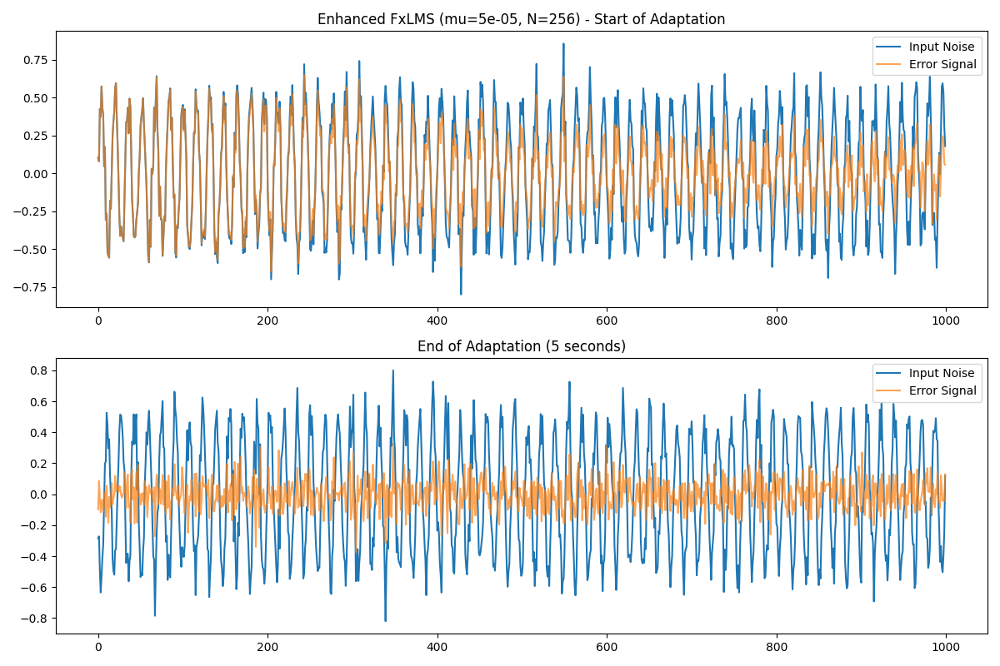
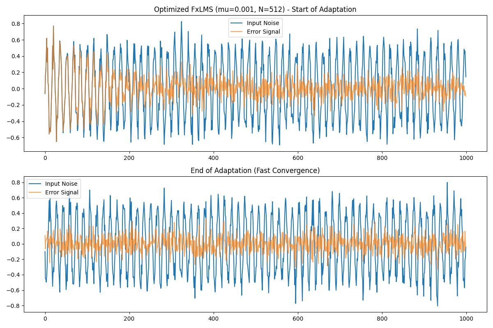

# FxLMS (Filtered-X Least Mean Squares)

This module implements **Active Noise Cancellation (ANC)** using the FxLMS algorithm. Unlike digital denoising, which masks noise in a recording, FxLMS is designed for real-time acoustic cancellation by generating an "anti-noise" signal in a physical space.

## 🛠 Features
- **Real-time Engine**: `anc.py` simulates the secondary path $S(z)$ and updates filter weights $W(z)$ on every sample.
- **Optimized DSP**: `optimized.py` achieves significant noise reduction (up to -20dB) for predictable, tonal hums.
- **Buffer Management**: Uses rotating NumPy buffers for low-latency dot-product calculation.

## 📈 Performance Results

We tested two versions of the FxLMS filter:

### 1. Enhanced FxLMS
A baseline implementation with 256 taps and a conservative learning rate.


### 2. Optimized FxLMS
Our final configuration with 512 taps and a tuned step-size, showing much faster convergence and deeper cancellation.


## 🚀 Usage
To run the ANC simulation:
```bash
python fxlms/anc.py
```
Outputs will be saved to the `test_results/` directory as `input`, `antinoise`, and `cleaned` WAV files.
